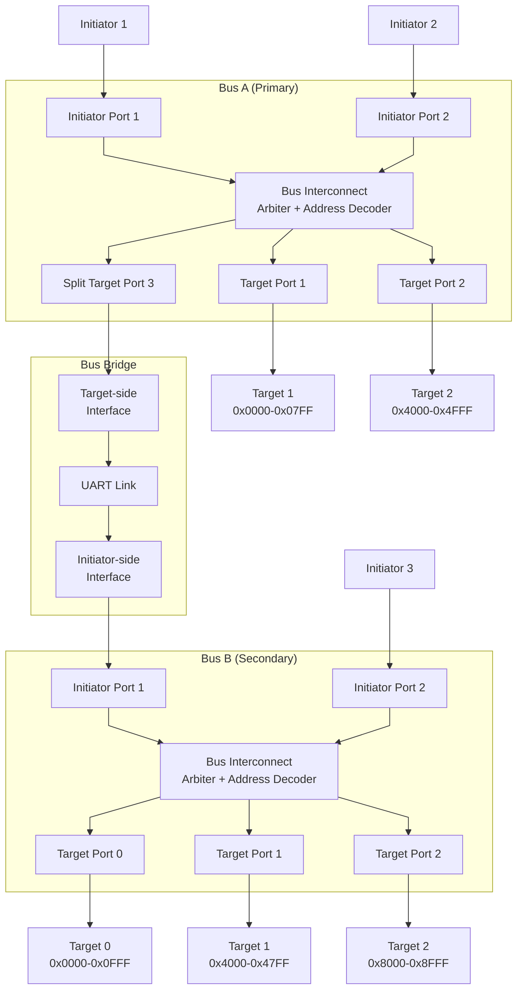
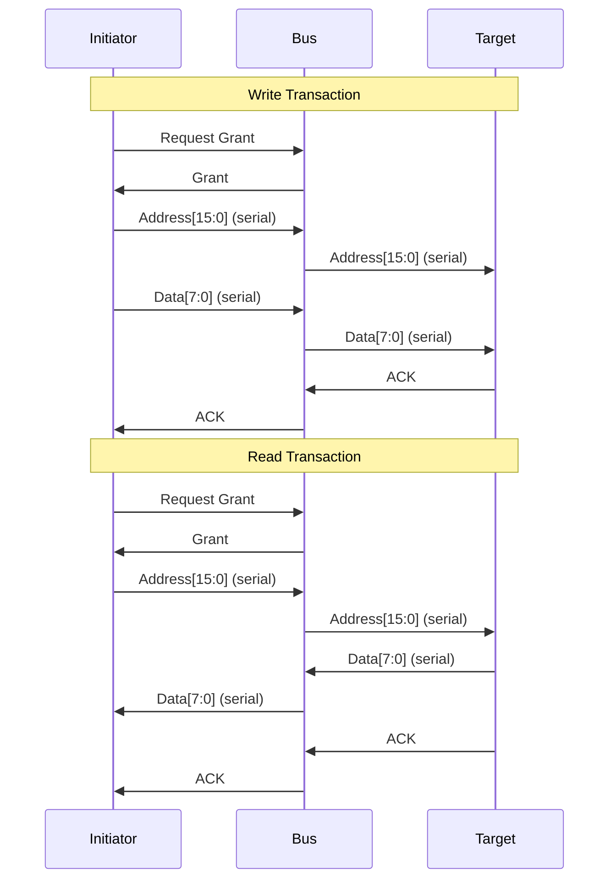
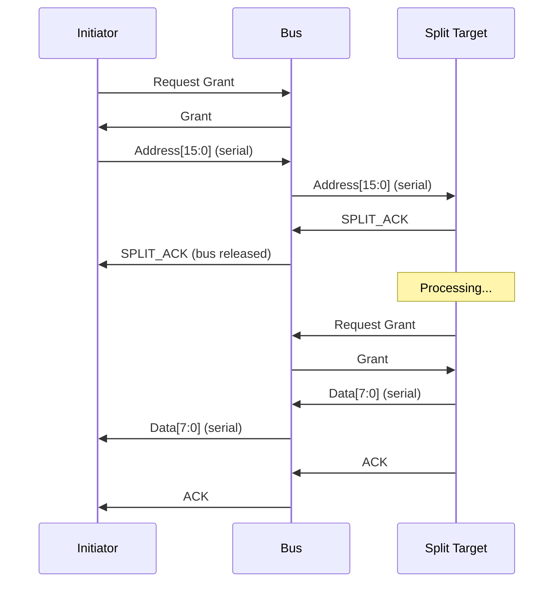
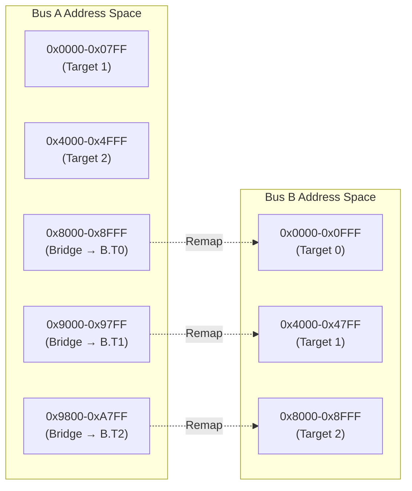

# Serial Bus Design

A lightweight, bit-serial system bus architecture implemented in SystemVerilog featuring multi-initiator arbitration, split-response transactions, and a transparent bus bridge for address space extension.

## Overview

This project implements a custom serial bus interconnect with the following capabilities:

- **Multi-initiator support** with priority-based arbitration
- **Bit-serial protocol** for reduced pin count and high speed data transfer (16-bit address + 8-bit data)
- **Split transactions** for non-blocking high-latency operations
- **Transparent bus bridge** connecting two independent buses with address remapping

## System Architecture

The system consists of two buses connected via a bridge:



## Bus Protocol

### Transaction Phases

Each bus transaction consists of two phases transmitted serially (LSB-first):

1. **Address Phase**: 16 bits transmitted bit-by-bit
2. **Data Phase**: 8 bits (for writes or read responses)



### Split Transactions

For high-latency operations, targets can issue a **split response**:



## Address Map

### Bus A Address Space

| Range             | Size  | Target   | Description   |
| ----------------- | ----- | -------- | ------------- |
| `0x0000 - 0x07FF` | 2 KB  | Target 1 | Local device  |
| `0x4000 - 0x4FFF` | 4 KB  | Target 2 | Local device  |
| `0x8000 - 0xA7FF` | 10 KB | Bridge   | Maps to Bus B |

### Bus B Address Space

| Range             | Size | Target   | Description   |
| ----------------- | ---- | -------- | ------------- |
| `0x0000 - 0x0FFF` | 4 KB | Target 0 | Remote device |
| `0x4000 - 0x47FF` | 2 KB | Target 1 | Remote device |
| `0x8000 - 0x8FFF` | 4 KB | Target 2 | Remote device |

### Bridge Address Remapping

The bridge transparently remaps Bus A addresses to Bus B:

```
Bus A Address → Bus B Address
───────────────────────────────
0x8000-0x8FFF → 0x0000-0x0FFF  (Target 0, 4KB)
0x9000-0x97FF → 0x4000-0x47FF  (Target 1, 2KB)
0x9800-0xA7FF → 0x8000-0x8FFF  (Target 2, 4KB)
```

**Mapping Formula:**

```
offset = bus_a_addr - 0x8000

if (offset < 0x1000):
    bus_b_addr = 0x0000 + offset
elif (offset < 0x1800):
    bus_b_addr = 0x4000 + (offset - 0x1000)
else:
    bus_b_addr = 0x8000 + (offset - 0x1800)
```



## Key Components

### Core Modules

| Module                 | Description                                             |
| ---------------------- | ------------------------------------------------------- |
| `bus.sv`               | Main bus interconnect with arbitration and multiplexing |
| `arbiter.sv`           | Priority-based arbiter for initiator requests           |
| `addr_decoder.sv`      | Decodes serial address stream to target select signals  |
| `init_port.sv`         | Initiator port with serial transmit/receive logic       |
| `target_port.sv`       | Target port with serial receive/transmit logic          |
| `split_target_port.sv` | Target port supporting split transactions               |

### Bus Bridge Modules

| Module                                 | Description                                   |
| -------------------------------------- | --------------------------------------------- |
| `bus_bridge.sv`                        | Top-level bridge wrapper                      |
| `bus_bridge_target_if.sv`              | Target interface with address remapping logic |
| `bus_bridge_initiator_if.sv`           | Initiator interface for Bus B                 |
| `bus_bridge_target_uart_wrapper.sv`    | Target-side UART serialization                |
| `bus_bridge_initiator_uart_wrapper.sv` | Initiator-side UART deserialization           |

### Top-Level Systems

| System                            | Description                                                  |
| --------------------------------- | ------------------------------------------------------------ |
| `system_top.sv`                   | Single bus system (Bus A only)                               |
| `system_top_with_bus_bridge.sv`   | Dual bus system with bridge (complete system)                |
| `system_top_with_bus_bridge_a.sv` | Bus A side of dual bus system (for separate FPGA deployment) |
| `system_top_with_bus_bridge_b.sv` | Bus B side of dual bus system (for separate FPGA deployment) |

## Configuration Parameters

Key parameters can be adjusted in module instantiations:

**Bus A Configuration** (`bus.sv`):

```systemverilog
TARGET1_BASE = 16'h0000
TARGET1_SIZE = 16'd2048    // 2 KB
TARGET2_BASE = 16'h4000
TARGET2_SIZE = 16'd4096    // 4 KB
TARGET3_BASE = 16'h8000    // Bridge base
TARGET3_SIZE = 16'd10240   // 10 KB (bridge region)
```

**Bridge Configuration** (`bus_bridge.sv`):

```systemverilog
BRIDGE_BASE_ADDR = 16'h8000
TARGET0_SIZE = 16'd4096    // Maps to Bus B Target 0
TARGET1_SIZE = 16'd2048    // Maps to Bus B Target 1
TARGET2_SIZE = 16'd4096    // Maps to Bus B Target 2
```

## Running Simulations

### Prerequisites

- SystemVerilog simulator (Mentor Questa/ModelSim, Synopsys VCS, Cadence Xcelium, or Verilator)

### Available Testbenches

| Testbench                          | Description                      |
| ---------------------------------- | -------------------------------- |
| `system_top_tb.sv`                 | Basic single-bus system test     |
| `system_top_with_bus_bridge_tb.sv` | Full dual-bus system with bridge |
| `bus_integration_tb.sv`            | Bus interconnect verification    |
| `split_target_integration_tb.sv`   | Split transaction testing        |

## Project Structure

```
serial-bus-design/
├── rtl/
│   ├── bus.sv
│   ├── arbiter.sv
│   ├── addr_decoder.sv
│   ├── init_port.sv
│   ├── target_port.sv
│   ├── split_target_port.sv
│   ├── initiator.sv
│   ├── target.sv
│   ├── split_target.sv
│   ├── bus_bridge.sv
│   ├── bus_bridge_target_if.sv
│   ├── bus_bridge_initiator_if.sv
│   ├── bus_bridge_target_uart_wrapper.sv
│   ├── bus_bridge_initiator_uart_wrapper.sv
│   ├── bus_bridge_pkg.sv
│   ├── system_top.sv
│   ├── system_top_with_bus_bridge.sv
│   ├── system_top_with_bus_bridge_a.sv
│   ├── system_top_with_bus_bridge_b.sv
│   └── uart/
│       ├── buadrate.v
│       ├── receiver.v
│       ├── transmitter.v
│       └── uart.v
└── tb/
    ├── addr_decoder_tb.sv
    ├── bus_dual_transaction_tb.sv
    ├── bus_integration_tb.sv
    ├── init_port_tb.sv
    ├── initiator_init_port_tb.sv
    ├── split_target_integration_tb.sv
    ├── split_target_port_tb.sv
    ├── system_integration_tb.sv
    ├── system_top_tb.sv
    ├── system_top_uart_dual_fpga_tb.sv
    ├── system_top_with_bus_bridge_dual_init_tb.sv
    ├── system_top_with_bus_bridge_tb.sv
    └── target_integration_tb.sv
```

## Design Highlights

### 1. Bit-Serial Protocol

- Reduces pin count (only 3 signals: data, valid, mode)
- Address transmitted LSB-first over 16 cycles
- Data transmitted LSB-first over 8 cycles

### 2. Split Transaction Support

- Targets can defer responses for long operations
- Bus released immediately after SPLIT_ACK
- Target arbitrates for bus when ready to respond
- Bus tracks original initiator for response routing

### 3. Transparent Bridge

- Address remapping handled automatically
- Split transactions used for bridge latency
- UART link demonstrates inter-chip communication
- Fully parameterized address windows
